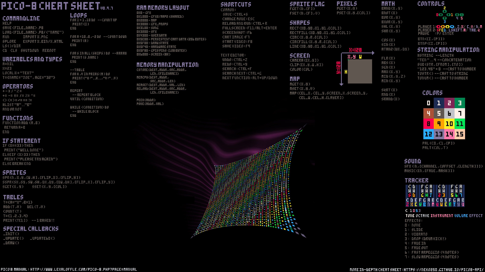
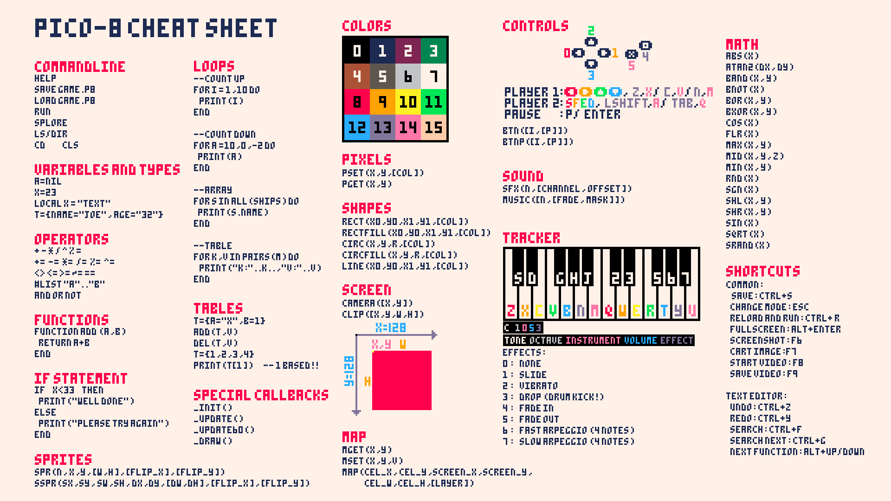
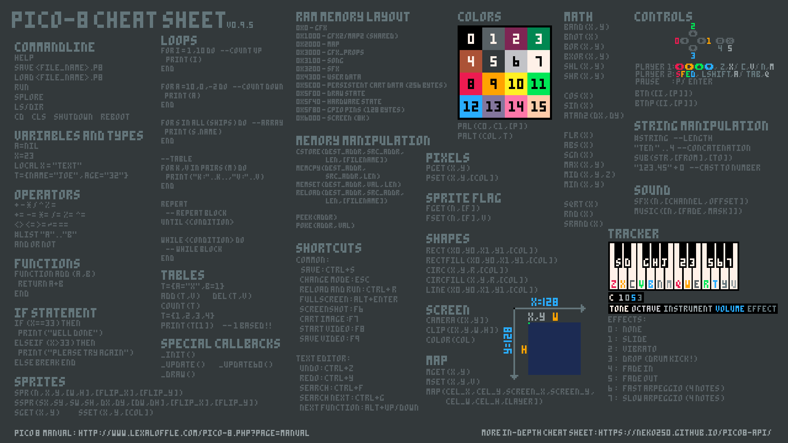

# Pico-8 Projects

Just a playground for my pico8 Projects.

## Setup

Point your pico8-instance to the given `carts` directory by either changing the config file or by passing the root path via a command line argument.
Starting pico8 could look something like this:

- Windows: `pico8.exe -root_path <path_to_the_carts_folder>`
- Linux: `pico8 -root_path <path_to_the_carts_folder>`

It is highly recommended that you use something like the VS Code extension "pico8vscodeeditor" from Grumpydev and "pico8-ls" from Pollywog Games to make your coding life easier.

## Cheat Sheets

<https://wh0am1.dev/pico8-api/>

